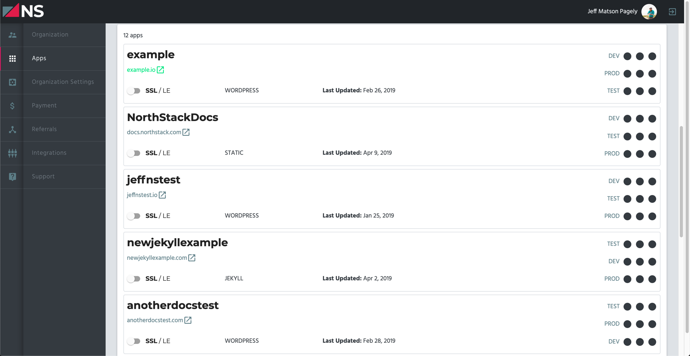

# Managing Apps

While most activities are handled within the NorthStack CLI, the NorthStack Console also offers some functionality when it comes to managing your NorthStack apps.

## Viewing Apps

To access a list of all of your NorthStack apps, log into the NorthStack Console and click on **Apps** within the left side menu.

## Other App Changes

Most app changes are done from within the NorthStack CLI. For more information, see our [NorthStack CLI documentation](/cli/).