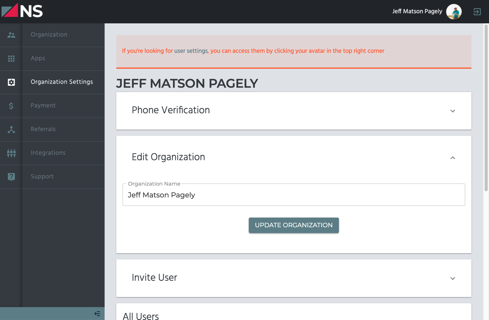

# Changing Organization Details

To change your organization details such as the name of the organization, log into the NorthStack Console and access the **Organization Settings** page.

Inside this page, you'll see a section labeled **Edit Organization** where you can update your organization details.

