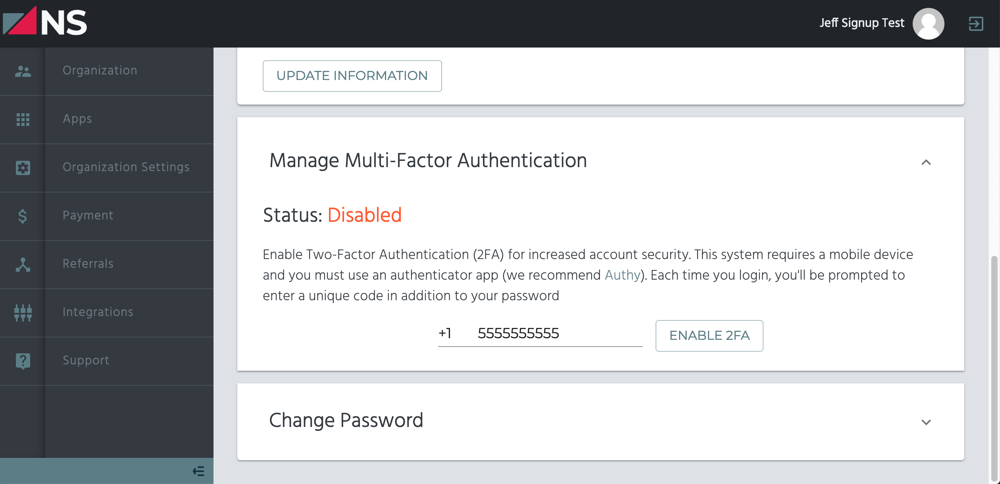
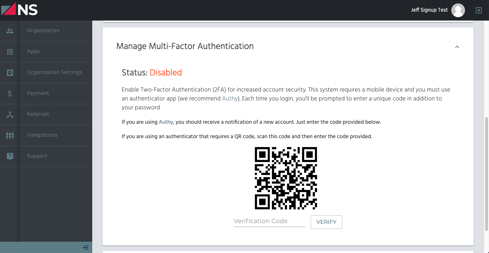

# Two-Factor Authentication

Using two-factor authentication is an important part of keeping your account safe from potential threats. With two-factor authentication, even if someone were to guess your password, an attacker would still need to have an additional code to get in.

Two-factor authentication adds a slight bit more effort to log into your account, but the benefits greatly outweight any downsides. In this article, we'll show you how to add two-factor authentication to your NorthStack account.

## Two-Factor Authentication Apps

There are multiple apps that you can use for configuring two-factor authentication, but here's a couple that we recommend:

* [Authy](https://authy.com/)
* [Google Authenticator](https://support.google.com/accounts/answer/1066447)

## Enabling Two-Factor Authentication in NorthStack

To enable two-factor authentication on your NorthStack account, follow these steps:

1. Begin by logging into the [NorthStack Console](https://console.northstack.com).
2. Next, access your user settings by clicking on your **user icon** at the top right of the page, then clicking on **User Settings**.
3. Inside the *User Settings* page, scroll down to the **Manage Multi-Factor Authentication** section. Within this section, your phone number should already be filled in. Double-check your phone number, then click the **Enable 2FA** button.
   
4. You will now be presented with a QR code. Using your authentication app, scan your QR code.
   
5. Upon scanning your QR code, you'll be presented with a verification code. Simply enter that verification code into the **Verification Code** field, then click on **Verify**.

Your account is now secured with two-factor authentication!
